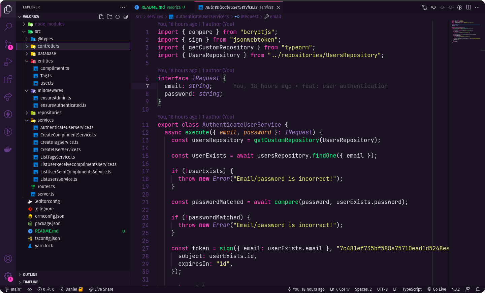

<h1 align="center">Valoriza</h1>

<p align="center">
  &logo=rocket" alt="Do Something Great" />
</p>

<p align="center">
  
</p>

## 💻 Projeto

Valoriza é uma plataforma para promover o reconhecimento entre companheiros de equipe.

## ✨ Tecnologias

Esse projeto foi desenvolvido com as seguintes tecnologias:

- [Node.js](https://nodejs.org/en/)
- [Express](https://expressjs.com/pt-br/)
- [TypeScript](https://www.typescriptlang.org/)
- [TypeORM](https://typeorm.io/#/)
- [JSON Web Token](https://jwt.io/)
- [Class Transformer](https://github.com/typestack/class-transformer)

## 🔗 Requisitos básicos

Antes de começar, você precisará ter as seguintes ferramentas instaladas em sua máquina:
- [Git](https://git-scm.com)

O projeto pode ser construído com npm ou yarn, então escolha uma das abordagens abaixo caso você não tenha nenhum instalado em seu sistema.

O Npm é distribuído com o Node.js, o que significa que quando você faz o download do Node.js, o npm é instalado automaticamente no seu computador
- [Node.js v14.16.0](https://nodejs.org/) ou maior.

Yarn é um gerenciador de pacotes criado pela equipe do Facebook e parece ser mais rápido do que o npm em geral.
- [Yarn v1.22.5](https://yarnpkg.com/) ou maior.

Além disso, é bom ter um editor para trabalhar com o código, como [VSCode](https://code.visualstudio.com/).

## :information_source: Como executar

Siga as instruções abaixo para baixar e usar o projeto deste repositório:

```bash
# Clone este repositório usando SSH
$ git clone git@github.com:danielhessell/valoriza.git
# ou clone usando https
$ git clone https://github.com/danielhessell/valoriza.git

# Vá para o repositório
$ cd valoriza

# Instale as dependências
$ yarn

# Executar migrações do banco
$ yarn typeorm migration:run

# Executar projeto
$ yarn dev:server
```

---

Made with :blue_heart: by [Daniel Hessel](https://www.linkedin.com/in/daniel-hessel-240731176/) :wave:
